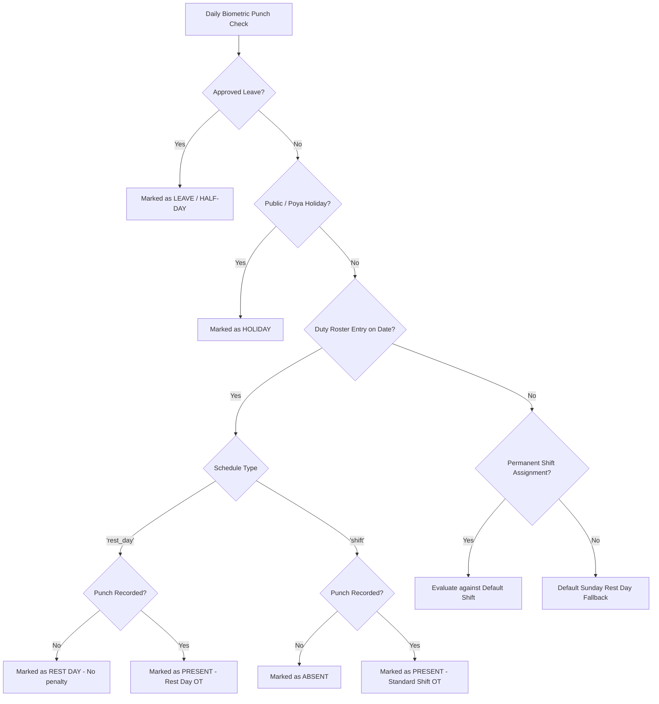

# M02 Shift Management & Duty Roster Standard Operating Workflows

## 1. Domain Terminology & Mental Model

Enterprise Workforce Management (WFM) platforms (e.g. UKG Pro/Kronos, SAP SuccessFactors, Workday, Deputy) enforce a strict separation between master configuration, contractual defaults, and time-bound operational schedules.

```
┌─────────────────────────────────────────────────────────────────────────────┐
│ 1. Shift Definitions (`shifts` table)                                       │
│    Location: [/shifts]                                                      │
│    • Atomic definition of working hours (e.g. Morning 06:00-14:00)           │
│    • Break durations, grace minutes, overtime threshold, night-shift flag   │
└──────────────────────────────────────┬──────────────────────────────────────┘
                                       │
                                       ▼
┌─────────────────────────────────────────────────────────────────────────────┐
│ 2. Contractual Baseline Defaults (`shift_assignments` table)                │
│    Location: [/shifts] (Lower section)                                      │
│    • Permanent baseline shift for standard 9–5 office personnel              │
│    • Applied indefinitely without requiring monthly calendar recreation     │
└──────────────────────────────────────┬──────────────────────────────────────┘
                                       │
                                       ▼
┌─────────────────────────────────────────────────────────────────────────────┐
│ 3. Duty Roster Matrix (`roster_entries` & `roster_patterns` tables)         │
│    Location: [/roster]                                                      │
│    • Operational calendar grid (Rows = Staff, Cols = Days 1 to 31)          │
│    • Dynamic day-by-day shift allocation and rest days (OFF)                │
│    • Multi-pattern generator (7-day, cyclical 4x2, single-shift, clone)     │
│    • Real-time cell overrides, atomic shift swaps, and leave protection     │
│    • Statutory worker fatigue rest interval checks (< 11 hours warning)     │
│    • Financial lock protection (auto-freezes when payroll runs)             │
└─────────────────────────────────────────────────────────────────────────────┘
```

---

## 2. The Two Workforce Operational Profiles

To eliminate administrative overhead, employees are categorized into two operational profiles:

### Profile A: Fixed Office Staff (9–5 Personnel)
* **Examples**: Executives, Human Resources, Finance & Accounts, Legal, Administration.
* **Characteristics**: Predictable working hours Monday through Friday; weekends (Saturday/Sunday) are fixed non-working days.
* **Operational Flow**:
  1. Open **Shift Definitions** (`/shifts`).
  2. Locate the employee under **Contractual Default Shift Assignments**.
  3. Assign the `"General Day (GEN-DAY)"` shift once with an effective date.
  4. **Done.** HR does **not** need to create or regenerate monthly duty rosters for these employees. The attendance engine automatically uses their contractual assignment.

### Profile B: Rotational & Operational Personnel
* **Examples**: Factory Workers, Security Guards, Hospital Staff, Hospitality Crew, Data Center Support.
* **Characteristics**: Shifts rotate (Morning / Evening / Night), operations run 24/7/365, and rest days fall dynamically throughout the week.
* **Operational Flow**:
  1. Open **Duty Roster Planner** (`/roster`).
  2. Select the target Year, Month, and Department.
  3. Click **Generate Roster** and select the appropriate pattern mode.
  4. Review daily coverage footers and statutory rest warnings (`⚠️ Rest X.Xh`).
  5. Click **Publish Roster** to activate the schedule for biometric punch matching.

---

## 3. Step-by-Step Standard Operating Procedure (SOP)

### Step 1: Define Atomic Shifts (`/shifts`)
Navigate to `/shifts` to create or adjust your organization's shift templates:
* **Code & Name**: e.g. `MORNING` (Morning Shift 06:00 - 14:00).
* **Start & End Time**: 24-hour format.
* **Break & Grace Minutes**: Deducted unpaid break time and permissible tardiness buffer.
* **Overtime Threshold**: Minutes of active work before standard 1.5x OT begins accumulating.
* **Night Shift Flag**: Check if the shift crosses midnight (triggers night differential rules).

> [!TIP]
> Use the **"Populate SL Presets"** button to automatically seed standard Sri Lankan shifts: Regular Day (08:30–17:00), Morning (06:00–14:00), Evening (14:00–22:00), Night (22:00–06:00), and Saturday Half-Day.

### Step 2: Assign Contractual Baselines for Fixed Staff (`/shifts`)
On the same page (`/shifts`), use the **Shift Assignments** table to link fixed-schedule personnel to their permanent shift. This creates an ongoing baseline.

### Step 3: Plan and Generate the Duty Roster (`/roster`)
For operational departments, navigate to `/roster`:
1. Use the header filters to choose the **Year**, **Month**, and optional **Department**.
2. Click **Generate Roster** in the top action bar.
3. Select from the **4 Generation Modes**:
   * **7-Day Weekly Matrix**: Map each day from Monday to Sunday to an explicit shift or Rest Day (`OFF`). Best for standard commercial retail or 6-day factory setups.
   * **Rolling N-Day Cyclical**: Select an anchor date and build a repeating sequence of $N$ steps (e.g. 4 days Morning $\rightarrow$ 2 days Rest Day). Perfect for continuous 24/7 security or manufacturing.
   * **Daily Single Shift**: Bulk assign one specific shift across the target date range with optional rest day exclusions.
   * **Month-to-Month Clone**: Duplicate the entire previous month's schedule structure onto the new month.
4. Keep **Preserve Approved Leaves** enabled so authorized leaves are not overwritten.
5. Click **Generate Roster**. The system executes an atomic, chunked UPSERT (250 rows per batch) in milliseconds.

### Step 4: Daily Operational Fine-Tuning
On the interactive roster matrix:
* **Cell Override**: Click any individual cell to change an employee's shift or convert a day to `Rest Day (OFF)`.
* **Atomic Shift Swap**: Click **Shift Swap** to securely exchange duties between two employees on a specific date.
* **Worker Fatigue Warning**: If an employee has $< 11.0$ hours of turnaround rest between consecutive shifts (e.g., Night shift followed immediately by Morning shift), the cell displays an amber warning badge (`⚠️ Rest 8.0h`).

### Step 5: Publishing & Financial Finalization
* **Draft vs. Published**: Rosters are created in `draft` mode. Once planned, click **Publish Roster** to activate the schedule.
* **Financial Lock**: When the M03 Payroll Run for that month is locked (`status = 'locked'`), all roster entries are automatically locked. No further generation, swaps, or edits can occur, protecting audit and EPF/ETF calculation integrity.

---

## 4. Attendance Precedence Architecture

The `AttendanceProcessingService` determines employee attendance by evaluating the following strict priority sequence:



---

## 5. Industry Comparison Summary

| Capability | Legacy / Basic Systems | Enterprise Standard (UKG, SAP, Deputy) | EMS Implementation |
| :--- | :--- | :--- | :--- |
| **Shift Engine** | Fixed start/end | Break policies, night flags, grace minutes, OT tiers | **Enterprise Standard** |
| **Roster Model** | Manual calendar typing | 4-mode algorithmic generation + spreadsheet matrix | **Enterprise Standard** |
| **Worker Fatigue** | None | Rest turnaround checks (<11h) under statutory labor law | **Enterprise Standard** |
| **Leave Protection**| Overwrites leaves | Preserves pre-approved leaves during bulk generation | **Enterprise Standard** |
| **Financial Integrity**| Editable at all times | Locked once payroll processing is finalized | **Enterprise Standard** |
| **Bulk Performance**| Hydrates thousands of ORMs | 250-row chunked database UPSERT in single transaction | **Enterprise Standard** |
