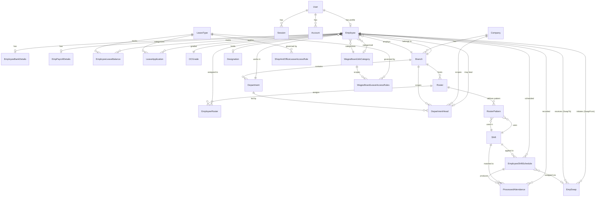

# Database Entity-Relationship Diagram

## ERD Diagram

---

## Entity Summary Table

| Entity | Table Name | PK | Key Unique Constraints | Relations |
|---|---|---|---|---|
| **User** | `user` | `id` (UUID) | `email`, `empNo` | → Employee, Sessions, Accounts |
| **Session** | `session` | `id` (UUID) | `token` | → User |
| **Account** | `account` | `id` (UUID) | `accountId` | → User |
| **Verification** | `verification` | `id` (UUID) | – | Standalone |
| **Employee** | `employee` | `id` (auto-int) | `empNo`, `email`, `userId` | → User, Branch, Dept, Designation, OCGrade, WagesBoardJobCategory |
| **EmployeeBankDetails** | `emp_bank_details` | `id` (auto-int) | `empNo` | → Employee |
| **EmpPayrollDetails** | `emp_payroll_details` | `id` (auto-int) | `empNo` | → Employee |
| **Company** | `company` | `id` (auto-int) | – | → Branches, DeptHeads |
| **Branch** | `branch` | `id` (auto-int) | – | → Company, Departments, Rosters, Employees |
| **Department** | `department` | `id` (auto-int) | – | → Branch, Employees, DeptHeads |
| **Designation** | `designation` | `id` (auto-int) | `designation` | → Employees |
| **DepartmentHead** | `department_head` | `id` (auto-int) | `empNo`, `@@unique(companyId, branchId, departmentId)` | → Company, Branch, Dept, Employee |
| **OCGrade** | `oc_grade` | `id` (auto-int) | `gradeCode` | → Employees |
| **Shift** | `shift` | `id` (auto-int) | `shiftName` | → ShiftSchedules, RosterPatterns, Attendance |
| **Roster** | `Roster` | `id` (auto-int) | – | → Branch, Patterns, EmployeeRosters |
| **RosterPattern** | `roster_pattern` | `id` (auto-int) | – | → Roster, Shift |
| **EmployeeRoster** | `employee_roster` | `id` (auto-int) | `@@unique(empNo, rosterId, effectiveFrom)` | → Employee, Roster |
| **EmployeeShiftSchedule** | `employee_shift_schedule` | `id` (auto-int) | `@@unique(empNo, date, shiftId)` | → Employee, Shift, EmpSwap |
| **EmpSwap** | `emp_shift_swap` | `id` (auto-int) | – | → Employee (from/to), ShiftSchedules |
| **HolidaySchedule** | `holiday_schedule` | `id` (auto-int) | – | Standalone |
| **LeaveType** | `leave_type` | `id` (auto-int) | `name` | → Applications, Balances, Rules |
| **LeaveApplication** | `leave_apllication` | `id` (auto-int) | – | → Employee, LeaveType |
| **EmployeeLeaveBalance** | `employee_leave_balance` | `id` (auto-int) | `@@unique(empNo, leaveTypeId, year)` | → Employee, LeaveType |
| **WagesBoardJobCategory** | `wages_board_job_category` | `id` (auto-int) | `name` | → Employees, LeaveRules |
| **WagesBoardLeaveAccessRules** | `wages_board_leave_access_rule` | `id` (auto-int) | `name`, `@@unique(leaveTypeId, jobCategoryId)` | → LeaveType, JobCategory |
| **ShopAndOfficeLeaveAccessRule** | `shop_and_office_leave_access_rule` | `id` (auto-int) | `name` | → LeaveType |
| **OtType** | `ot_type` | `id` (auto-int) | `otType` | Standalone |
| **RawFingerprintLog** | `raw_Fingerprint_log` | `id` (auto-int) | – | Standalone (staging) |
| **ProcessedAttendance** | `processed_attendance` | `id` (auto-int) | `@@unique(empNo, shiftScheduleId)` | → Employee, Shift, ShiftSchedule |

---

## Enums

| Enum | Values |
|---|---|
| `AttendanceMode` | `GENERAL`, `SHIFT` |
| `EmploymentStatus` | `PROBATION`, `PERMANENT`, `CONTRACT` |
| `EmploymentCategory` | `SHOP_AND_OFFICE`, `WAGES_BOARD` |
| `LeaveStatus` | `PENDING`, `APPROVED`, `REJECTED` |
| `LeaveTypes` | `ANNUAL`, `CASUAL`, `OTHER` |
| `AttendanceStatus` | `PRESENT`, `ABSENT`, `HALF_DAY`, `LATE`, `ON_LEAVE`, `HOLIDAY`, `WEEKEND` |
| `holiday_types` | `Government`, `Company`, `Poya`, `Commercial` |
