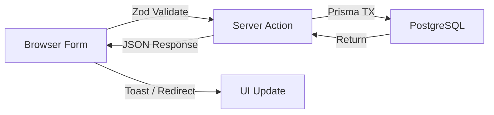

# System Architecture Overview

## Application Identity

| Property | Value |
|---|---|
| **Name** | HR-EMS (Human Resource – Employee Management System) |
| **Version** | 0.1.0 |
| **Type** | Full-stack monolithic web application |
| **Framework** | Next.js 15.2 (App Router + Turbopack) |
| **Runtime** | Node.js (server-side) + React 19 (client-side) |

---

## Architecture Pattern

```
┌─────────────────────────────────────────────────────────────┐
│                        Client (Browser)                     │
│  React 19  ·  shadcn/ui  ·  Radix Primitives  ·  Tailwind  │
└───────────────────────────┬─────────────────────────────────┘
                            │ HTTP / WebSocket (Turbopack HMR)
┌───────────────────────────▼─────────────────────────────────┐
│                    Next.js 15 App Router                    │
│  ┌──────────────┐  ┌────────────────┐  ┌────────────────┐  │
│  │  Pages (RSC)  │  │ Server Actions │  │ API Routes     │  │
│  │  app/ems/**   │  │ lib/server-    │  │ app/api/auth/* │  │
│  │  app/(auth)** │  │ actions/**     │  │                │  │
│  └──────────────┘  └────────────────┘  └────────────────┘  │
│                            │                                │
│               ┌────────────▼────────────┐                   │
│               │   Prisma ORM (v6.19)    │                   │
│               └────────────┬────────────┘                   │
│                            │                                │
│               ┌────────────▼────────────┐                   │
│               │   PostgreSQL Database   │                   │
│               └─────────────────────────┘                   │
└─────────────────────────────────────────────────────────────┘
```

### Key Patterns

| Pattern | Implementation |
|---|---|
| **Rendering** | React Server Components (RSC) by default; `"use client"` for interactive UI |
| **Data Mutations** | Next.js Server Actions (`"use server"` functions) |
| **Authentication** | `better-auth` library with Prisma adapter |
| **Validation** | Zod schemas (shared between client and server) |
| **Routing** | File-system routing via Next.js App Router with route groups `(auth)`, `(employee)`, `(hrm)`, `(attendance)`, `(ta)`, `(report)` |
| **Middleware** | Edge middleware for session-based route protection |
| **UI Library** | shadcn/ui (Radix + Tailwind CSS v4) |

---

## Route Group Architecture

```
app/
├── (auth)/                   # Unauthenticated: sign-in, sign-up, password flows
│   ├── sign-in/
│   ├── sign-up/
│   ├── forgot-password/
│   └── reset-password/
├── (employee)/               # Employee self-service portal (role: "user")
│   ├── emp-dashboard/
│   └── emp-profile/
├── api/auth/                 # better-auth API endpoints
├── dashboard/                # Admin dashboard (redirects to /ems)
└── ems/                      # Main EMS admin panel (role: "admin")
    ├── (hrm)/                # Human Resource Management
    │   ├── (employee)/       # Employee CRUD
    │   └── (master)/         # Org master data (Company, Branch, Dept, etc.)
    ├── (attendance)/         # Roster & shift management
    │   ├── shift/
    │   ├── roster/
    │   ├── assign-roster/
    │   ├── view-roster/
    │   ├── all-roster/
    │   └── manage-roster/
    ├── (ta)/                 # Time & Attendance
    │   ├── attendance/       # Fingerprint upload & processing
    │   └── setting/          # Holidays, leave types, leave rules, OT types
    ├── (report)/             # Reporting module
    │   └── employee/
    ├── components/           # EMS-scoped layout components
    ├── data/                 # Static constants (JSON)
    └── dashboard/            # EMS landing page
```

---

## Data Flow



### Fingerprint → Attendance Pipeline

```mermaid
flowchart TD
    F["Biometric Device / CSV Export"] -->|Manual Upload| G["importAttendanceRawLog()"]
    G -->|Parse & Insert| H["raw_Fingerprint_log"]
    H -->|syncAttendance()| I["Match against EmployeeShiftSchedule"]
    I -->|Window-based IN/OUT detection| J["processed_attendance"]
    J -->|Anomaly Detection| K["needsReview / colorCode flags"]
```
