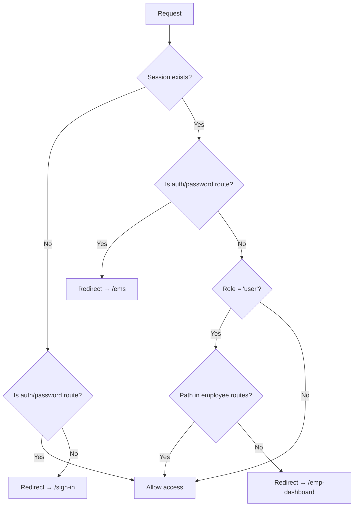

# Module: Authentication & Authorization

## Overview

Session-based authentication using `better-auth` with email/password credentials, role-based route protection, and password reset via email.

---

## Models

### User
| Field | Type | Constraints | Notes |
|---|---|---|---|
| `id` | String (UUID) | PK, auto-generated | |
| `email` | String | Unique | Login credential |
| `name` | String? | Optional | Display name |
| `emailVerified` | Boolean | Required | Email verification status |
| `image` | String? | Optional | Avatar URL |
| `role` | String | Required | `"admin"` or `"user"` |
| `empNo` | Int | Unique | Links to Employee |
| `activeStatus` | Boolean | Default: `true` | Account active/inactive |
| `createdAt` | DateTime | Required | |
| `updatedAt` | DateTime | Required | |

### Session
| Field | Type | Constraints | Notes |
|---|---|---|---|
| `id` | String (UUID) | PK | |
| `token` | String | Unique | Session token |
| `expiresAt` | DateTime | Required | 7-day expiry |
| `userId` | String | FK → User | Cascade delete |

### Account
| Field | Type | Constraints | Notes |
|---|---|---|---|
| `id` | String (UUID) | PK | |
| `accountId` | String | Unique | Provider account ID |
| `providerId` | String | Required | e.g., `"credential"` |
| `password` | String? | Optional | bcrypt hash |
| `userId` | String | FK → User | Cascade delete |

### Verification
| Field | Type | Constraints | Notes |
|---|---|---|---|
| `id` | String (UUID) | PK | |
| `identifier` | String | Required | Email/token identifier |
| `value` | String | Required | Token value |
| `expiresAt` | DateTime | Required | Token expiry |

---

## Server Actions

| Action | File | Description |
|---|---|---|
| `LogoutAction` | `lib/server-actions/logout.ts` | Gets session, calls `auth.api.signOut()`, redirects to `/` |

---

## Auth Configuration (`lib/auth.ts`)

```typescript
session: {
  expiresIn: 60 * 60 * 24 * 7,    // 7 days
  updateAge: 60 * 60 * 24 * 1,    // Rolling refresh every 1 day
}
user: {
  additionalFields: { role, empNo, activeStatus }
}
emailAndPassword: {
  enabled: true,
  autoSignIn: false,
  sendResetPassword: async ({ user, url, token }) => { ... }
}
```

---

## Validation Schemas (`lib/auth-schema.ts`)

| Schema | Fields | Rules |
|---|---|---|
| `signUpFormSchema` | name, email, password, role, empNo | name: 2-50 chars; password: 6-50 chars |
| `signInFormSchema` | email, password | email: valid format; password: 6-50 chars |
| `forgetPasswordSchema` | email | Valid email format |
| `resetPasswordSchema` | password, confirmPassword | Passwords must match; 6-50 chars each |

---

## Middleware (`middleware.ts`)

### Route Classification

| Route Group | Paths | Access Rule |
|---|---|---|
| **Auth Routes** | `/sign-in`, `/sign-up` | Unauthenticated only; authenticated users redirected to `/ems` |
| **Password Routes** | `/forgot-password`, `/reset-password` | Unauthenticated only |
| **Admin Routes** | `/ems` | Reserved for admin role |
| **Employee Routes** | `/emp-dashboard`, `/emp-profile`, `/emp-attendance` | `role: "user"` only |

### Protection Flow



### Matcher Pattern
```
/((?!api|_next/static|_next/image|.*\.png$).*)
```
Excludes: API routes, static assets, images.

---

## Routes

| Route | Page | Layout |
|---|---|---|
| `/sign-in` | Sign-in form | `(auth)/layout.tsx` |
| `/sign-up` | Sign-up form | `(auth)/layout.tsx` |
| `/forgot-password` | Email input for reset | `(auth)/layout.tsx` |
| `/reset-password` | New password form | `(auth)/layout.tsx` |
| `/api/auth/*` | better-auth API handlers | None |

---

## UI Components

| Component | Purpose |
|---|---|
| `LoginNavBar` | Navigation bar on auth pages |
| `NavUser` | Sidebar user dropdown with sign-out action |
| `EmsTopNavBar` | Top bar with user controls |
