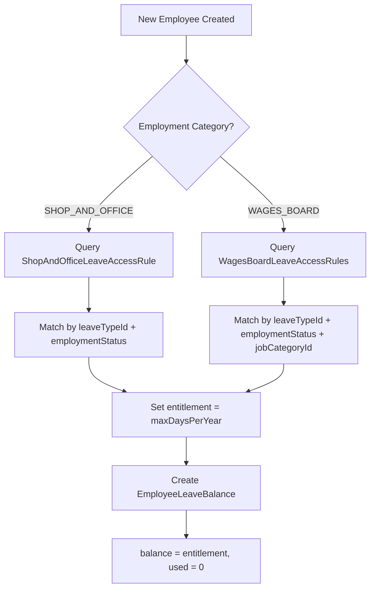
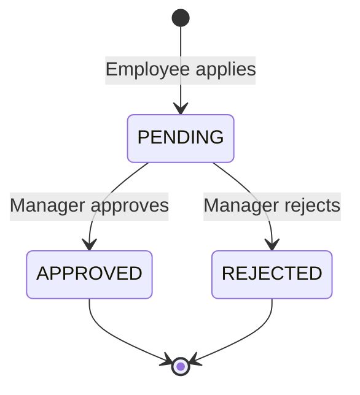

# Module: Leave & OT Management

## Overview

Manages leave types, leave access rules (split by employment category), leave applications, employee leave balances, and overtime type definitions.

---

## Models

### LeaveType
| Field | Type | Constraints | Notes |
|---|---|---|---|
| `id` | Int | PK, auto-increment | |
| `name` | String | Unique | e.g., "Annual Leave" |
| `description` | String? | Optional | |
| `leaveType` | String | Required | `ANNUAL`, `CASUAL`, `OTHER` |

**Business Rule:** Only one `ANNUAL` and one `CASUAL` type can exist (enforced in server action).

### LeaveApplication
| Field | Type | Constraints | Notes |
|---|---|---|---|
| `id` | Int | PK, auto-increment | |
| `empNo` | Int | FK → Employee | Applicant |
| `leaveTypeId` | Int | FK → LeaveType | |
| `fromDate` | DateTime | Required | Leave start |
| `toDate` | DateTime | Required | Leave end |
| `reason` | String? | Optional | |
| `status` | LeaveStatus | Default: `PENDING` | `PENDING / APPROVED / REJECTED` |
| `appliedAt` | DateTime | Default: `now()` | |

### EmployeeLeaveBalance
| Field | Type | Constraints | Notes |
|---|---|---|---|
| `id` | Int | PK, auto-increment | |
| `empNo` | Int | FK → Employee | |
| `leaveTypeId` | Int | FK → LeaveType | |
| `year` | Int | Required | e.g., 2025 |
| `entitlement` | Int | Required | Total for year |
| `used` | Int | Default: `0` | Days taken |
| `balance` | Int | Default: `0` | Remaining (entitlement - used) |
| `carriedOver` | Int? | Optional | From previous year |

**Unique:** `@@unique([empNo, leaveTypeId, year])` — one balance per employee per leave type per year.

### WagesBoardLeaveAccessRules
| Field | Type | Constraints | Notes |
|---|---|---|---|
| `id` | Int | PK | |
| `name` | String | Unique | Rule name |
| `leaveTypeId` | Int | FK → LeaveType | |
| `employmentStatus` | EmploymentStatus | Enum | `PROBATION / PERMANENT / CONTRACT` |
| `jobCategoryId` | Int? | FK → WagesBoardJobCategory | Optional |
| `maxDaysPerYear` | Int | Required | Maximum days allowed |
| `carryForward` | Boolean | Required | Can carry forward? |
| `carryForwardValidUntill` | Int | Required (if carryForward) | Days valid |

**Unique:** `@@unique([leaveTypeId, jobCategoryId])` — prevents duplicate rules per leave type per category.

### ShopAndOfficeLeaveAccessRule
| Field | Type | Constraints | Notes |
|---|---|---|---|
| `id` | Int | PK | |
| `name` | String | Unique | Rule name |
| `employmentStatus` | EmploymentStatus | Enum | |
| `leaveTypeId` | Int | FK → LeaveType | |
| `maxDaysPerYear` | Int | Required | |
| `carryForward` | Boolean | Required | |
| `carryForwardValidUntill` | Int | Required (if carryForward) | |

### OtType
| Field | Type | Constraints | Notes |
|---|---|---|---|
| `id` | Int | PK, auto-increment | |
| `rate` | Float | Required | Multiplier (e.g., 1.5, 2.0) |
| `otType` | String | Unique | `"Single"`, `"Double"`, `"Triple"` |
| `description` | String? | Optional | |

---

## Server Actions

### Leave Type (`lib/server-actions/ems/ta/leaveType.ts`)

| Action | Description |
|---|---|
| `SaveLeaveType` | Create leave type. Prevents duplicate `ANNUAL` and `CASUAL` types. |
| `getAllLeaveType` | Fetch all leave types with id, name, leaveType, description. |

### Wages Board Leave Rules (`lib/server-actions/ems/ta/wagesBoardLeaveAccessRule-action.ts`)

| Action | Description |
|---|---|
| `SaveWagesBoardLeaveAccessRules` | Create rule; handles `P2002` for composite unique violation. |
| `getWagesBoardAllRules` | Fetch all rules with leave type name and job category details. |

### Shop & Office Leave Rules (`lib/server-actions/ems/ta/shopNofficeLeaveAccessRule-action.ts`)
Parallel implementation for Shop & Office employment category.

### OT Types (`lib/server-actions/ems/ta/otTypeActions.ts`)
CRUD operations for overtime type definitions.

---

## Validation Schemas

### `wagesBoardLeaveAccessRuleSchema`

| Field | Validation | Notes |
|---|---|---|
| `ruleName` | `string().min(1)` | |
| `leaveTypeId` | `coerce.number().min(1)` | |
| `employmentStatus` | `nativeEnum(EmploymentStatus)` | |
| `jobCategoryId` | `coerce.number().optional()` | |
| `minDaysWorked` | `coerce.number().optional()` | |
| `maxDaysPerYear` | `coerce.number().min(1)` | |
| `carryForward` | `coerce.boolean()` | Default: `false` |
| `carryForwardValidUntill` | `coerce.number().optional()` | Required if carryForward = true |

**Refinement:** If `carryForward === true`, then `carryForwardValidUntill` must be `> 0`.

### `ShopAndOfficeLeaveAccessRuleSchema`
Same structure as wages board schema but without `jobCategoryId`.

### `addLeaveTypeSchema`

| Field | Validation |
|---|---|
| `name` | `string().min(1)` |
| `description` | `string()` |
| `leaveType` | `string().min(1)` |

### `addOTTypeSchema`

| Field | Validation |
|---|---|
| `otType` | `string().min(1)` |
| `rate` | `coerce.number().positive()` |
| `description` | `string().optional()` |

---

## Leave Entitlement Flow

---

## Leave Status State Machine

---

## Routes

| Route | Page | Description |
|---|---|---|
| `/ems/setting/manageLeaveType` | Leave Types | CRUD for leave types |
| `/ems/setting/leaveAccessRules` | Leave Access Rules | Configure leave entitlements |
| `/ems/setting/manageOtTypes` | OT Types | CRUD for overtime types |
| `/ems/leave/apply` | Apply Leave | Employee leave application (planned) |
| `/ems/leave/approve` | Approve Leave | Manager leave approval (planned) |
| `/ems/leave/calendar` | Leave Calendar | Calendar view of leaves (planned) |
| `/ems/leave/balance` | Leave Balances | Employee balance view (planned) |
