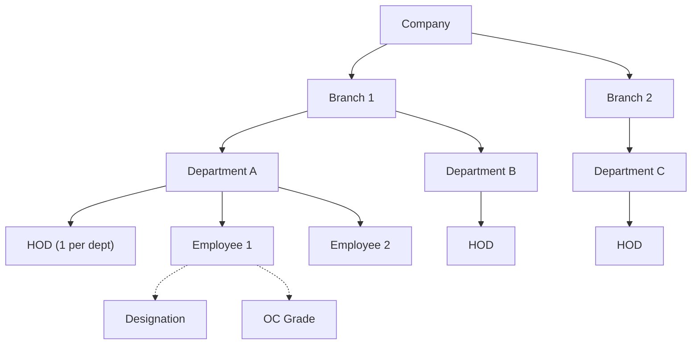

# Module: Organization Master Data

## Overview

Manages the hierarchical organizational structure: Company → Branch → Department → Designation, plus OC Grades, Department Heads (HOD), and Wages Board Job Categories.

---

## Models

### Company
| Field | Type | Constraints | Notes |
|---|---|---|---|
| `id` | Int | PK, auto-increment | |
| `name` | String | Required | Company name |
| `address` | String | Required | |
| `contactTel` | String | Required | |
| `city` | String | Required | |
| `fax` | String? | Optional | |
| `email` | String? | Optional | |

### Branch
| Field | Type | Constraints | Notes |
|---|---|---|---|
| `id` | Int | PK, auto-increment | |
| `companyId` | Int | FK → Company | Parent company |
| `name` | String | Required | Branch name |
| `address` | String | Required | |
| `contactTel` | String | Required | |
| `city` | String | Required | |
| `fax` | String? | Optional | |
| `email` | String? | Optional | |

### Department
| Field | Type | Constraints | Notes |
|---|---|---|---|
| `id` | Int | PK, auto-increment | |
| `department` | String | Required | Department name |
| `branchId` | Int | FK → Branch | Parent branch |

### Designation
| Field | Type | Constraints | Notes |
|---|---|---|---|
| `id` | Int | PK, auto-increment | |
| `designation` | String | Unique | Designation title |

### DepartmentHead
| Field | Type | Constraints | Notes |
|---|---|---|---|
| `id` | Int | PK, auto-increment | |
| `companyId` | Int | FK → Company | |
| `branchId` | Int | FK → Branch | |
| `departmentId` | Int | FK → Department | |
| `empNo` | Int | Unique, FK → Employee | One HOD per department |

**Composite Unique:** `@@unique([companyId, branchId, departmentId])` — enforces single HOD per department.

### OCGrade
| Field | Type | Constraints | Notes |
|---|---|---|---|
| `id` | Int | PK, auto-increment | |
| `gradeCode` | String | Unique | e.g., `"91"`, `"24"` |
| `gradeName` | String | Required | e.g., `"General Worker"` |

### WagesBoardJobCategory
| Field | Type | Constraints | Notes |
|---|---|---|---|
| `id` | Int | PK, auto-increment | |
| `name` | String | Unique | Category name |
| `entitleStartDay` | Int | Required | Leave entitlement start day |
| `entitleEndDay` | Int | Required | Leave entitlement end day |
| `devidedDaysBy` | Int | Required | Divisor for pro-rata calculation |
| `maxAnnualLeave` | Int | Required | Maximum annual leave days |

---

## Server Actions

### Company (`lib/server-actions/ems/company.ts`)

| Action | Description |
|---|---|
| `SaveCompany` | Create company (simple, name-only) |
| `getAllCompanies` | Fetch all companies (ordered by name) |
| `searchCompanies` | Case-insensitive search, top 10 results |
| `addCompany` | Create with duplicate check (case-insensitive `findFirst`) |

### Branch (`lib/server-actions/ems/branch.ts`)

| Action | Description |
|---|---|
| `getAllBranches` | Fetch all branches (ordered by name) |
| `getBranchesByCompany` | Filter branches by `companyId` |
| `searchBranches` | Case-insensitive search, top 10 |
| `addBranch` | Create with duplicate check |

### Department (`lib/server-actions/ems/department.ts`)

| Action | Description |
|---|---|
| `getAllDepartment` | Fetch all departments (ordered by name) |
| `searchDepartment` | Case-insensitive search, top 10 |
| `addDepartment` | Create with duplicate check |

### Designation (`lib/server-actions/ems/designation.ts`)

| Action | Description |
|---|---|
| `getAllDesignation` | Fetch all designations (ordered alphabetically) |
| `searchDesignation` | Case-insensitive search, top 10 |
| `addDesignation` | Create with duplicate check |

### HOD (`lib/server-actions/ems/hrm/manage-hod-action.ts`)

| Action | Description |
|---|---|
| `getEmployeeByDepartment` | List employees by department for HOD selection |
| `saveHod` | Assign HOD (validates via `assignHodSchema`) |
| `getAllHods` | List all HODs with company/branch/dept names |
| `getEmployeesHod` | List employees for HOD change dialog |
| `changeHod` | Update HOD (handles `P2002` unique constraint) |

### OC Grade (`lib/server-actions/ems/hrm/oc_grade_actions.ts`)
CRUD operations for organizational grades.

### Wages Board (`lib/server-actions/ems/hrm/manage-wages-board-action.ts`)
CRUD operations for wages board job categories.

---

## Validation Schemas

| Schema | Fields | Key Rules |
|---|---|---|
| `addCompanySchema` | companyName, address, contactTel, city, fax, email | All `min(1)` |
| `addBranchSchema` | companyId, branchName, address, contactTel, city, fax, email | contactTel: max 10; fax: max 10; email: `.email()` |
| `addDepartmentSchema` | department, branchId | branchId: coerce number |
| `addDesignationSchema` | designation | `min(1)` |
| `assignHodSchema` | companyId, branchId, departmentId, empNo | All coerced numbers |
| `changeHodSchema` | id, empNo, companyId, branchId, departmentId | All coerced numbers |
| `addOCGradeSchema` | gradeCode, gradeName | Both `min(1)` |
| `addWagesBoardCategorySchema` | name, entitleStartDay, entitleEndDay, devidedDaysBy, maxAnnualLeave | All positive numbers |

---

## Routes

| Route | Page | Description |
|---|---|---|
| `/ems/manage-company` | Manage Companies | Company CRUD |
| `/ems/manage-branches` | Manage Branches | Branch CRUD with company filter |
| `/ems/manage-departments` | Manage Departments | Department CRUD with branch filter |
| `/ems/manage-designations` | Manage Designations | Designation CRUD |
| `/ems/manage-hod` | Manage HOD | Assign/change department heads |
| `/ems/manage-oc-grades` | Manage OC Grades | Grade code CRUD |
| `/ems/manage-weges-board-category` | Wages Board Categories | Job category CRUD |

---

## Organizational Hierarchy

