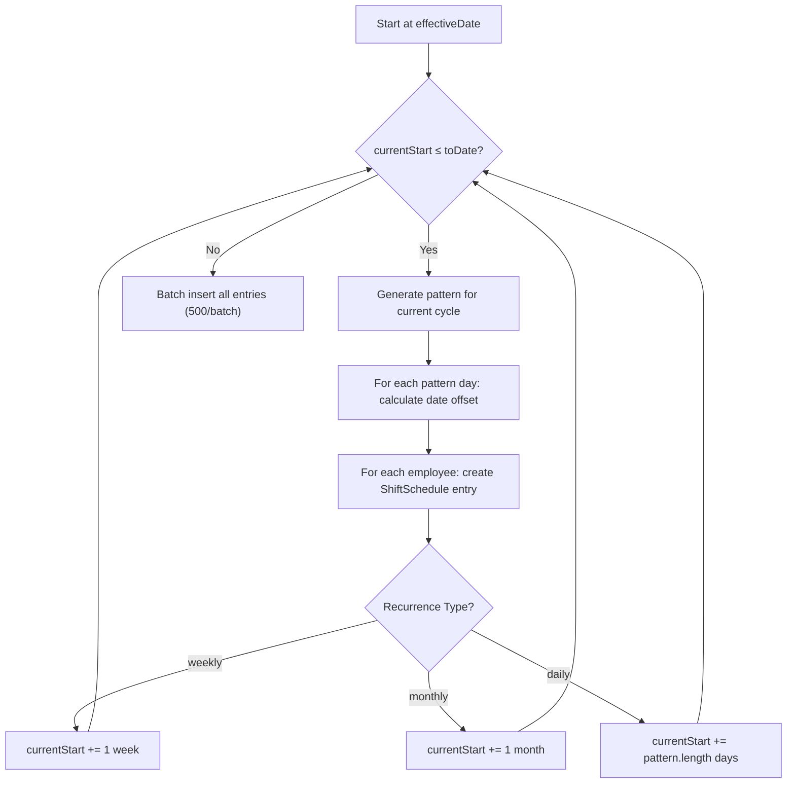

# Module: Roster & Shift Management

## Overview

Manages shift definitions, roster creation with recurring patterns, employee-to-roster assignment with shift schedule expansion, and shift swaps.

---

## Models

### Shift
| Field | Type | Constraints | Notes |
|---|---|---|---|
| `id` | Int | PK, auto-increment | |
| `shiftName` | String | Unique | e.g., "Morning", "Night", "Off Day" |
| `startTime` | String? | HH:MM format | Null for off shifts |
| `endTime` | String? | HH:MM format | |
| `firstHalfEndTime` | String? | HH:MM | Marks end of first half |
| `secondHalfStartTime` | String? | HH:MM | Marks start of second half |
| `earlyInAsOT` | Boolean? | Optional | Count early arrival as OT |
| `earlyInAsAttIn` | Boolean? | Optional | Use early arrival as attendance IN |
| `lateAllowable` | Int? | Minutes | Grace period for late arrival |
| `earlyLeaveAllowable` | Int? | Minutes | Grace period for early departure |
| `workingMinutes` | Int? | Minutes | Expected working duration |
| `overTimeStartTime` | String? | HH:MM | When OT counting starts |
| `offShift` | Boolean | Default: `false` | Marks as day-off shift |
| `shiftColor` | String | Required | Hex color for calendar display |
| `inWindowBeforeStart` | Int | Default: `0` | Minutes before shift start to accept IN punch |
| `inWindowAfterStart` | Int | Default: `0` | Minutes after shift start to accept IN punch |
| `outWindowBeforeEnd` | Int | Default: `0` | Minutes before shift end to accept OUT punch |
| `outWindowAfterEnd` | Int | Default: `0` | Minutes after shift end to accept OUT punch |
| `spansMidnight` | Boolean | Default: `false` | Night shift flag |
| `createdBy` | Int | Required | Creator's empNo |

### Roster
| Field | Type | Constraints | Notes |
|---|---|---|---|
| `id` | Int | PK, auto-increment | |
| `name` | String | Required | Roster name |
| `fromDate` | DateTime | Required | Roster start date |
| `toDate` | DateTime | Required | Roster end date |
| `recurrentType` | String | Required | `"daily"`, `"weekly"`, `"monthly"` |
| `averageHours` | Float? | Optional | Average working hours |
| `status` | Boolean | Default: `true` | Active/inactive |
| `branchId` | Int | FK → Branch | Branch scope |

### RosterPattern
| Field | Type | Constraints | Notes |
|---|---|---|---|
| `id` | Int | PK, auto-increment | |
| `date` | DateTime | Required | Pattern day date |
| `shiftId` | Int | FK → Shift | Shift for this day |
| `startTime` | String? | Optional override | |
| `endTime` | String? | Optional override | |
| `rosterId` | Int | FK → Roster | Parent roster |
| `note` | String? | Optional | |

### EmployeeRoster
| Field | Type | Constraints | Notes |
|---|---|---|---|
| `id` | Int | PK | |
| `empNo` | Int | FK → Employee | |
| `rosterId` | Int | FK → Roster | |
| `allocatedAt` | DateTime | Default: `now()` | Assignment timestamp |
| `effectiveFrom` | DateTime | Required | When employee starts this roster |
| `effectiveTo` | DateTime | Default: `now()` | When assignment ends |

**Unique:** `@@unique([empNo, rosterId, effectiveFrom])`

### EmployeeShiftSchedule
| Field | Type | Constraints | Notes |
|---|---|---|---|
| `id` | Int | PK | |
| `empNo` | Int | FK → Employee | |
| `date` | DateTime | Required | The specific day |
| `shiftId` | Int | FK → Shift | |
| `startTime` | String? | Optional override | |
| `endTime` | String? | Optional override | |
| `source` | String | Required | `"roster"` or `"manual"` |
| `swapedWithId` | Int? | FK → EmpSwap | |
| `inWindowBeforeStartOverride` | Int? | Per-schedule override | |
| `inWindowAfterStartOverride` | Int? | Per-schedule override | |
| `outWindowBeforeEndOverride` | Int? | Per-schedule override | |
| `outWindowAfterEndOverride` | Int? | Per-schedule override | |
| `spansMidnightOverride` | Boolean? | Per-schedule override | |
| `doubleShiftContinuation` | Boolean? | Default: `false` | Double shift marker |

**Unique:** `@@unique([empNo, date, shiftId])` — prevents duplicate shift per employee per day.

### EmpSwap
| Field | Type | Constraints | Notes |
|---|---|---|---|
| `id` | Int | PK | |
| `fromEmpNo` | Int | FK → Employee | Swap initiator |
| `toEmpNo` | Int | FK → Employee | Swap receiver |
| `date` | DateTime | Required | Swap date |
| `approved` | Boolean | Default: `false` | |
| `approvedBy` | Int? | Optional | Approver empNo |
| `approvedAt` | DateTime? | Optional | Approval timestamp |

---

## Server Actions

### Shift Creation (`lib/server-actions/ems/createShift.ts`)

**`CreateShiftAction`**
1. Validate session (get `createdBy` from `session.user.empNo`)
2. Validate input via `createShift` schema
3. Check for duplicate shift name
4. If `isOff = true`: create minimal payload (`shiftName`, `offShift: true`, `shiftColor`)
5. If `isOff = false`: create full payload with all time and window fields
6. Insert into `Shift` table

### Roster Creation (`lib/server-actions/ems/roster/saveRoster.ts`)

**`SaveRoster`**
1. Execute within Prisma transaction:
   - Create `Roster` record with name, branch, dates, recurrence type
   - Map pattern array → `RosterPattern` rows with shift assignments
   - Bulk insert patterns via `createMany`

### Roster Assignment (`lib/server-actions/asign-roster/employeeToRoster.ts`)

**`assignEmployeesToRoster`** — Most complex business logic:

1. **Validate** effective date
2. **Fetch** roster details and pattern
3. **Fetch** shift details for all pattern shifts (build shift map)
4. **Validate** employee assignment eligibility:
   - First-time: effective date ≥ roster start date
   - Re-assignment: effective date > previous `effectiveTo`
5. **Transaction**: Create `EmployeeRoster` records + update `rosterFlag = "Y"`
6. **Expand pattern**: Generate concrete `EmployeeShiftSchedule` entries
   - Weekly: `addWeeks(currentStart, 1)` per cycle
   - Monthly: `addMonths(currentStart, 1)` per cycle
   - Daily: `addDays(currentStart, pattern.length)` per cycle
7. **Batch insert**: Insert shift entries in batches of 500 (`skipDuplicates: true`)

**`getUnassignedEmployees`** — Filter employees by department where `rosterFlag = "N"`.

**`getAssigenedEmployeesByDpt`** — List assigned employees with their latest roster allocation.

**`removeEmpFromRoster`** — Remove employee:
1. Delete future `EmployeeShiftSchedule` entries after removal date
2. Set `rosterFlag = "N"` on Employee
3. Update `effectiveTo` on `EmployeeRoster` to removal date - 1 day

### General Roster Actions

| Action | File | Description |
|---|---|---|
| `getShifts` | `rosterAllAction.ts` | Fetch all shifts (ordered by name) |
| `SearchDepartmentAction` | `employeeToRoster.ts` | Search departments for assignment form |
| `searchRosters` | `employeeToRoster.ts` | Search rosters by name |

---

## Validation Schemas

| Schema | Purpose | Key Fields |
|---|---|---|
| `createShift` | Shift creation | shiftName, startTime, endTime, windows, `isOff` conditional validation |
| `rosterCreateSchema` | Roster creation | rosterName, branch, avgHW, fromDate, toDate, recurrent |
| `employeeToRosterSchema` | Assignment | departmentId, effectiveFrom, rosterId |
| `manageEmpSchema` | Employee management | empNo, empName, fromDate, toDate |
| `searchRoster` | Roster search | designationId, fromDate, toDate |

### Shift Schema Conditional Validation

When `isOff = false`, the following fields become required via `superRefine`:
- shiftName, shiftColor, startTime, endTime
- workingMinutes, firstHalfEndTime, secondHalfStartTime
- lateAllowable, earlyLeaveAllowable
- overTimeStartTime
- All 4 window fields + spansMidnight

---

## Routes

| Route | Page | Description |
|---|---|---|
| `/ems/shift` | Shift Management | Create/view shifts |
| `/ems/roster` | Create Roster | Roster creation with pattern builder |
| `/ems/view-roster` | View Roster | Roster details/calendar |
| `/ems/all-roster` | All Rosters | Roster listing |
| `/ems/assign-roster` | Assign Roster | Assign employees to rosters |
| `/ems/manage-roster` | Manage Roster | Roster administration |

---

## Pattern Expansion Algorithm

