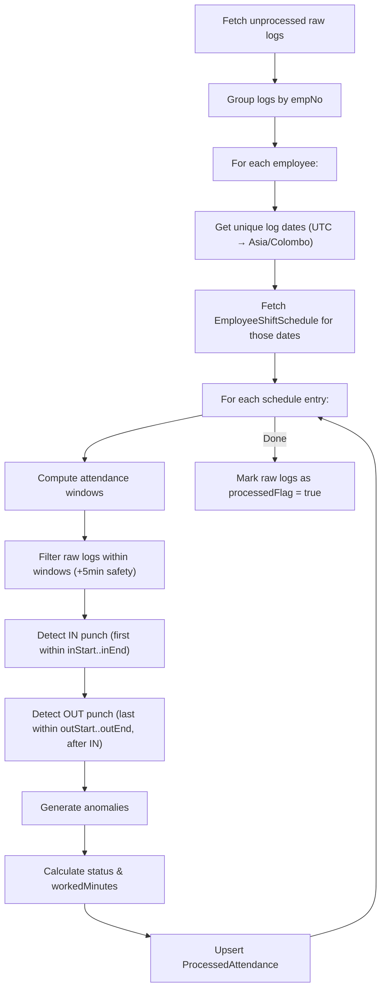

# Module: Time & Attendance

## Overview

Handles biometric fingerprint log import, raw-to-processed attendance synchronization, attendance window matching, anomaly detection, and holiday schedule management.

---

## Models

### RawFingerprintLog
| Field | Type | Constraints | Notes |
|---|---|---|---|
| `id` | Int | PK, auto-increment | |
| `empNo` | Int? | Optional | May be null for unregistered |
| `name` | String? | Optional | From device |
| `punchDate` | DateTime | Required | Exact punch timestamp |
| `state` | String? | Optional | e.g., `"C/In"`, `"C/Out"` |
| `newState` | String? | Optional | Device state |
| `exception` | String? | Optional | e.g., `"Repeat"` |
| `operation` | String? | Optional | |
| `synceAt` | DateTime | Default: `now()` | Import timestamp |
| `processedFlag` | Boolean | Default: `false` | Processing status |

### ProcessedAttendance
| Field | Type | Constraints | Notes |
|---|---|---|---|
| `id` | Int | PK, auto-increment | |
| `empNo` | Int | FK → Employee | |
| `shiftScheduleId` | Int | FK → EmployeeShiftSchedule | |
| `attendanceDate` | DateTime | Required | |
| `inTime` | DateTime? | Optional | Detected IN punch |
| `outTime` | DateTime? | Optional | Detected OUT punch |
| `shiftId` | Int? | FK → Shift | |
| `status` | AttendanceStatus | Default: `PRESENT` | |
| `workedMinutes` | Int? | Optional | Calculated |
| `otMinutes` | Int? | Optional | Overtime minutes |
| `isHoliday` | Boolean | Default: `false` | |
| `needsReview` | Boolean | Default: `false` | Anomaly flag |
| `colorCode` | String? | Optional | `"F87171"` (red), `"#FB923C"` (orange) |
| `anomalies` | Json? | Optional | Array of anomaly objects |

**Unique:** `@@unique([empNo, shiftScheduleId])` — one attendance per shift per employee.

### HolidaySchedule
| Field | Type | Constraints | Notes |
|---|---|---|---|
| `id` | Int | PK, auto-increment | |
| `date` | DateTime | Required | Holiday date |
| `description` | String | Required | Holiday name |
| `type` | String | Required | Government / Company / Poya / Commercial |
| `status` | Boolean | Default: `true` | Active/inactive |

---

## Attendance Status Enum

| Status | Description |
|---|---|
| `PRESENT` | Both IN and OUT detected |
| `ABSENT` | Neither IN nor OUT detected |
| `HALF_DAY` | Only IN or only OUT detected |
| `LATE` | IN detected after allowable time |
| `ON_LEAVE` | On approved leave |
| `HOLIDAY` | Public/company holiday |
| `WEEKEND` | Weekend day |

---

## Server Actions

### Upload Attendance (`lib/server-actions/ems/ta/uploadAttendance-action.ts`)

**`importAttendanceRawLog(fileContent: string)`**

Parses CSV/text export from biometric device.

**CSV Format:**
```
AC-No  Name  Date       Time     State  NewState  Exception  Operation
1      1     19/08/2025 7:12 AM  C/In   ...       Repeat     ...
```

**Flow:**
1. Parse each line: extract `empNo`, `punchDate`, `state`, etc.
2. Convert date format (`DD/MM/YYYY` + `H:mm AM/PM` → ISO)
3. Find latest existing punch date in DB
4. Filter records to only insert those **after** the latest existing date
5. Bulk insert via `createMany({ skipDuplicates: true })`
6. Return `{ inserted, skipped, lastImportAt }`

**`LastRecordData()`** — Fetch the most recent raw log timestamp.

---

### Sync Attendance (`lib/server-actions/ems/ta/sync-attendance-action.ts`)

**`syncAttendance()`** — Core attendance processing engine.

**Algorithm:**



**Window Resolution (`resolveWindows`):**

```
inStart  = shiftStart - inWindowBeforeStart (minutes)
inEnd    = shiftStart + inWindowAfterStart (minutes)
outStart = shiftEnd   - outWindowBeforeEnd (minutes)
outEnd   = shiftEnd   + outWindowAfterEnd (minutes)
```

Override priority: `EmployeeShiftSchedule override → Shift default → 0`

For midnight-spanning shifts: `endDt += 24 hours` if `spansMidnight || endDt < startDt`.

**Anomaly Detection:**

| Code | Severity | Condition |
|---|---|---|
| `MISSING_IN` | RED | No punch found in IN window |
| `MISSING_OUT` | RED | IN found but no punch in OUT window |

**Status Determination:**

| Condition | Status |
|---|---|
| IN + OUT | `PRESENT` |
| IN only OR OUT only | `HALF_DAY` |
| Neither | `ABSENT` |

---

### Holiday Management (`lib/server-actions/ems/ta/holiday-action.ts`)

| Action | Description |
|---|---|
| `saveHoliday` | Create holiday with Zod validation; handles `P2002` duplicate error |
| `getHolidaysByYear` | Fetch holidays for a given year (date range filter) |
| `deleteHolidayById` | Delete single holiday by ID |

---

## Validation Schemas

| Schema | Fields | Rules |
|---|---|---|
| `uploadAttendanceSchema` | uploadFile | File instance required |
| `syncAttendanceSchema` | fromDate, toDate, empNos, reprocess, includeUnregistered | Dates as `YYYY-MM-DD` strings |
| `addHolidaySchema` | date, description, type | All `min(1)` |
| `getHolidaysSchema` | year | `min(1)` |

---

## Routes

| Route | Page | Description |
|---|---|---|
| `/ems/attendance/uploadAttendance` | Import Attendance | Upload biometric CSV |
| `/ems/setting/holidaySchedule` | Holiday Schedule | Manage holidays |

---

## Timezone Handling

- Raw logs stored in UTC
- Processing converts to **Asia/Colombo** (`UTC+5:30`) using Luxon
- `toSriLankanDateString()` ensures correct local date grouping
- Attendance dates normalized to midnight in Sri Lankan timezone
