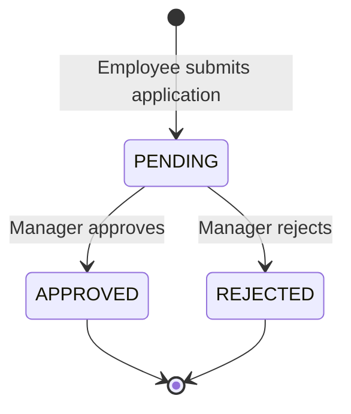
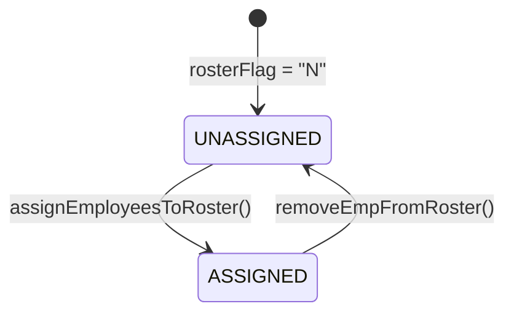
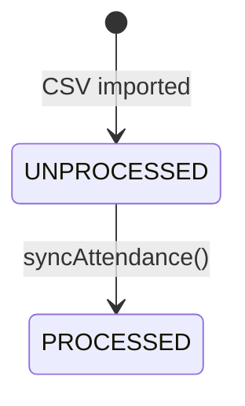
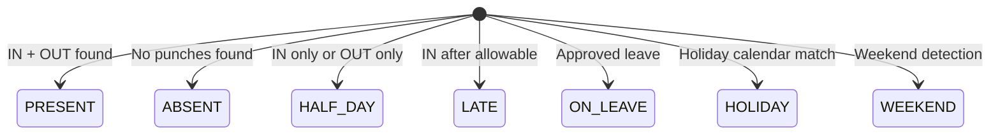
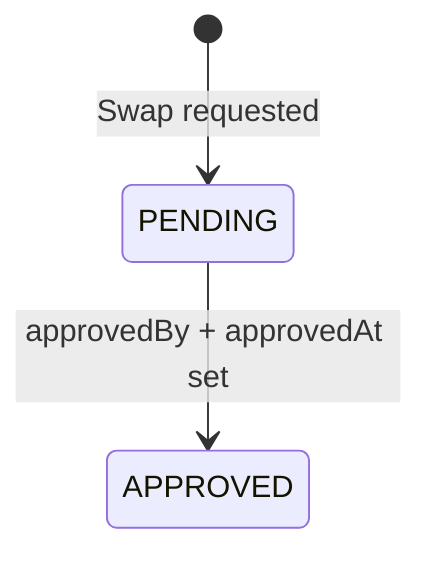
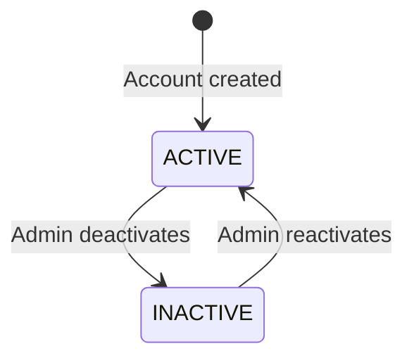

# State Machines

## 1. Leave Application Status

| State | Description | Allowed Transitions |
|---|---|---|
| `PENDING` | Awaiting approval | → APPROVED, → REJECTED |
| `APPROVED` | Leave granted | Terminal state |
| `REJECTED` | Leave denied | Terminal state |

---

## 2. Employee Roster Assignment Status

| State | Flag | Description |
|---|---|---|
| `UNASSIGNED` | `rosterFlag = "N"` | Employee has no active roster |
| `ASSIGNED` | `rosterFlag = "Y"` | Employee is on an active roster |

### Transition: UNASSIGNED → ASSIGNED
1. Create `EmployeeRoster` record
2. Set `rosterFlag = "Y"` on Employee
3. Expand roster pattern into `EmployeeShiftSchedule` entries

### Transition: ASSIGNED → UNASSIGNED
1. Delete future `EmployeeShiftSchedule` entries (after removal date)
2. Set `rosterFlag = "N"` on Employee
3. Update `effectiveTo` on `EmployeeRoster` to `removalDate - 1`

---

## 3. Raw Fingerprint Log Processing Status

| State | Flag | Description |
|---|---|---|
| `UNPROCESSED` | `processedFlag = false` | Raw log awaiting processing |
| `PROCESSED` | `processedFlag = true` | Log has been matched to shifts |

---

## 4. Attendance Status (Computed)

> **Note:** Status is computed during `syncAttendance()` and stored on `ProcessedAttendance`. It is not transitioned — it is assigned based on punch analysis.

---

## 5. Shift Swap Approval

| State | Field | Description |
|---|---|---|
| `PENDING` | `approved = false` | Swap awaiting approval |
| `APPROVED` | `approved = true` | Swap approved by manager |

---

## 6. User Account Status

| State | Field | Description |
|---|---|---|
| `ACTIVE` | `activeStatus = true` | Can log in |
| `INACTIVE` | `activeStatus = false` | Login disabled |
