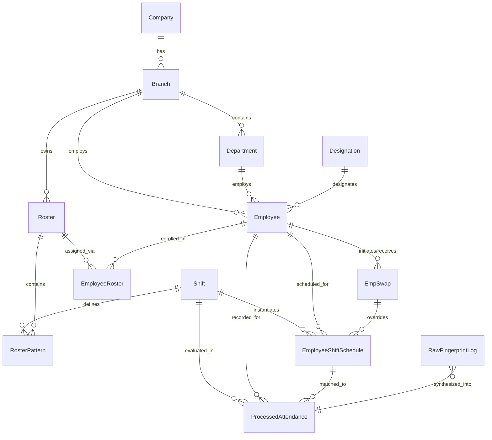

# HR-EMS Full System Technical Architecture & Specification

## 1. Executive Summary & System Capability Matrix

The **HR-EMS (Human Resource & Enterprise Management System)** is a full-featured workforce management platform designed to manage complex organizational hierarchies, multi-branch operations, labor law-compliant leave allocations, dynamic shift planning, recurring roster scheduling, and automated biometric time and attendance processing.

### Core Capabilities Overview

| Module | Core Capabilities | Key Database Entities |
| :--- | :--- | :--- |
| **Organizational Master Data** | Multi-company, multi-branch, multi-department, designations, organizational grades (OC Grades), and single-HOD-per-department enforcement. | `Company`, `Branch`, `Department`, `Designation`, `DepartmentHead`, `OCGrade` |
| **Employee Master Management** | Employee profiles, dual attendance modes (`GENERAL` vs `SHIFT`), employment status (`PROBATION`, `PERMANENT`, `CONTRACT`), and dual labor frameworks (`SHOP_AND_OFFICE` vs `WAGES_BOARD`). | `Employee`, `EmployeeBankDetails`, `EmpPayrollDetails`, `WagesBoardJobCategory` |
| **Leave & Statutory Compliance** | Wages Board vs Shop and Office statutory leave access rules, annual leave formulas based on entitlement brackets, carry-forward validity limits, balance ledger tracking. | `LeaveType`, `WagesBoardLeaveAccessRules`, `ShopAndOfficeLeaveAccessRule`, `LeaveApplication`, `EmployeeLeaveBalance` |
| **Shift Engine** | Configurable start/end times, half-day cutoffs, early-in handling (as OT or attendance), allowable grace periods, midnight-spanning shifts, and 4-tier attendance punch windows. | `Shift` |
| **Roster Engine** | Branch-specific master rosters with recurrent patterns (Daily, Weekly, Monthly), shift-to-date mappings, and cyclic template generation. | `Roster`, `RosterPattern` |
| **Roster-Employee Allocation** | Multi-employee department assignments, chronological continuity validation, recurrence expansion into granular daily schedules, and automated unassignment/cleanup. | `EmployeeRoster`, `EmployeeShiftSchedule` |
| **Shift Swapping** | Peer-to-peer shift trade initiation, approval workflow, and schedule reallocation. | `EmpSwap` |
| **Time & Attendance (TA)** | Biometric fingerprint punch log ingestion, tolerance window filtering, anomaly tagging (`MISSING_IN`, `MISSING_OUT`), status classification (`PRESENT`, `HALF_DAY`, `ABSENT`), and worked minutes / OT aggregation. | `RawFingerprintLog`, `ProcessedAttendance`, `HolidaySchedule`, `OtType` |

---

## 2. Complete Entity-Relationship (ER) Architecture

The following diagram illustrates how Shifts, Rosters, Employees, Schedules, and Attendance interact:



---

## 3. Deep Dive: Shift Creation & Specification

A **Shift** in this system is not simply a label with a start and end time; it is a parameter-rich configuration that dictates how attendance capture devices evaluate biometric punches, overtime, and work duration.

### 3.1 Shift Data Model Specification

```prisma
model Shift {
  id                  Int      @id @default(autoincrement())
  shiftName           String   @unique
  startTime           String?  // Format "HH:mm" (24-hour)
  endTime             String?  // Format "HH:mm" (24-hour)
  firstHalfEndTime    String?  // Format "HH:mm"
  secondHalfStartTime String?  // Format "HH:mm"
  earlyInAsOT         Boolean? // Treat punches before startTime as overtime
  earlyInAsAttIn      Boolean? // Treat early punches as attendance punch-in
  lateAllowable       Int?     // Grace period minutes for late arrivals
  earlyLeaveAllowable Int?     // Grace period minutes for early departure
  workingMinutes      Int?     // Expected standard work duration in minutes
  overTimeStartTime   String?  // Format "HH:mm" - timestamp where OT accrual begins
  offShift            Boolean  @default(false) // Flags rest days / off days
  shiftColor          String   // Hex code (e.g. "#10B981") for visual UI calendar
  
  // Attendance Punch Matching Windows (in minutes)
  inWindowBeforeStart Int      @default(0) // Minutes before startTime valid for IN punch
  inWindowAfterStart  Int      @default(0) // Minutes after startTime valid for IN punch
  outWindowBeforeEnd  Int      @default(0) // Minutes before endTime valid for OUT punch
  outWindowAfterEnd   Int      @default(0) // Minutes after endTime valid for OUT punch
  spansMidnight       Boolean  @default(false) // True if shift crosses 00:00

  createdAt           DateTime @default(now())
  createdBy           Int      // User/EmpNo who created the shift
}
```

### 3.2 Shift Types & Business Rules

1. **Regular Working Shifts (`offShift = false`)**:
   - Requires valid `startTime`, `endTime`, `firstHalfEndTime`, `secondHalfStartTime`, `workingMinutes`, `shiftColor`, and all four attendance window parameters.
   - **Working Minutes Calculation Rule**:
     $$\Delta\text{minutes} = (\text{endHour} \times 60 + \text{endMinute}) - (\text{startHour} \times 60 + \text{startMinute})$$
     If $\Delta\text{minutes} < 0$, $\Delta\text{minutes} = \Delta\text{minutes} + (24 \times 60)$.
   - **Spans Midnight Flag (`spansMidnight`)**:
     Explicitly set to `true` when the shift starts on day $D$ and ends on day $D+1$ (e.g., 22:00 to 06:00).
2. **Off Shifts / Rest Day (`offShift = true`)**:
   - Used within rosters to designate scheduled days off, rest days, or off-duty rotations.
   - Only requires `shiftName`, `shiftColor`, `offShift: true`, and `createdBy`. All time fields and window configurations are nullified.

### 3.3 Biometric In/Out Attendance Windows Logic

The 4 attendance window fields prevent cross-shift punch collision when biometric devices submit raw logs:
- **IN Window Range**:
  $$[\text{startTime} - \text{inWindowBeforeStart}, \quad \text{startTime} + \text{inWindowAfterStart}]$$
- **OUT Window Range**:
  $$[\text{endTime} - \text{outWindowBeforeEnd}, \quad \text{endTime} + \text{outWindowAfterEnd}]$$

If `spansMidnight` is true or $\text{endDt} < \text{startDt}$, the $\text{endDt}$ is mathematically shifted $+24\text{ hours}$ when computing the OUT windows.

---

## 4. Deep Dive: Roster Creation & Pattern Templating

A **Roster** defines a master shift scheduling schedule linked to a specific company branch, covering a defined calendar timeframe (`fromDate` to `toDate`) and governed by a recurrence cycle.

### 4.1 Roster & Pattern Data Models

```prisma
model Roster {
  id            Int             @id @default(autoincrement())
  name          String
  fromDate      DateTime
  toDate        DateTime
  recurrentType String          // "daily" | "weekly" | "monthly"
  averageHours  Float?          // Expected average weekly/monthly working hours
  status        Boolean         @default(true) // Active status
  branchId      Int
  branch        Branch          @relation(fields: [branchId], references: [id])
  createdAt     DateTime        @default(now())

  employees     EmployeeRoster[]
  patternDays   RosterPattern[]
}

model RosterPattern {
  id        Int      @id @default(autoincrement())
  date      DateTime // Base template reference date
  shiftId   Int
  startTime String?  // Defaults from Shift, can be custom overridden
  endTime   String?  // Defaults from Shift, can be custom overridden
  rosterId  Int
  note      String?
  roster    Roster   @relation(fields: [rosterId], references: [id])
  shift     Shift    @relation(fields: [shiftId], references: [id])

  @@map("roster_pattern")
}
```

### 4.2 Recurrence Types and Pattern Generation Logic

The system supports three recurrence models:

| Recurrence Model | Minimum Pattern Length | Validation Constraints | Expansion Step |
| :--- | :--- | :--- | :--- |
| **`weekly`** | Exactly 7 Days | Must cover all 7 unique day-of-week indices (Sunday = 0 to Saturday = 6) without duplicate weekdays. | Advancing `currentStart` by $+1\text{ week}$ (`addWeeks(currentStart, 1)`). |
| **`monthly`** | 28 to 31 Days | Must cover unique calendar dates (1 through 28, 30, or 31) without duplicate day-of-month indices. | Advancing `currentStart` by $+1\text{ month}$ (`addMonths(currentStart, 1)`). |
| **`daily`** | $N$ Days ($N \ge 1$) | Cyclical rotation of $N$ shifts (e.g., 2 Morning, 2 Evening, 2 Night, 2 Off). | Advancing `currentStart` by $+N\text{ days}$ (`addDays(currentStart, pattern.length)`). |

### 4.3 Roster Generation Algorithm (Template Generation)

When the user simulates or builds the roster pattern over an arbitrary date span:
1. `start = new Date(fromDate)` (normalized to 00:00:00)
2. `end = new Date(toDate)` (normalized to 00:00:00)
3. Total days: $D = \text{ceil}\left(\frac{\text{end} - \text{start}}{86,400,000}\right) + 1$
4. For day index $i = 0 \dots (D - 1)$:
   $$\text{currentDate} = \text{start} + i\text{ days}$$
   $$\text{patternIndex} = i \pmod{\text{pattern.length}}$$
   $$\text{assignedShift} = \text{pattern}[\text{patternIndex}].\text{shiftId}$$

### 4.4 Persistence Workflow (`SaveRoster`)

Saving a roster runs in a single database transaction (`prisma.$transaction`):
1. Create `Roster` master record (`name`, `branchId`, `fromDate`, `toDate`, `recurrentType`, `averageHours`).
2. Map pattern items to array attaching `rosterId = savedRoster.id`.
3. `RosterPattern.createMany`: Bulk insert the template rows with their respective `date`, `shiftId`, `startTime`, and `endTime`.

---

## 5. Deep Dive: Assigning Roster to Employees & Schedule Expansion

This is the most critical and complex process in the system: taking high-level employee roster enrollments and automatically materializing concrete daily records in `EmployeeShiftSchedule`.

### 5.1 Assignment & Schedule Data Models

```prisma
model EmployeeRoster {
  id            Int      @id @default(autoincrement())
  empNo         Int
  rosterId      Int
  allocatedAt   DateTime @default(now())
  effectiveFrom DateTime // Date when employee begins this roster
  effectiveTo   DateTime @default(now()) // Bound to roster.toDate
  employee      Employee @relation(fields: [empNo], references: [empNo])
  roster        Roster   @relation(fields: [rosterId], references: [id])

  @@unique([empNo, rosterId, effectiveFrom])
  @@map("employee_roster")
}

model EmployeeShiftSchedule {
  id           Int      @id @default(autoincrement())
  empNo        Int
  date         DateTime // Specific calendar date (normalized to 00:00:00)
  shiftId      Int
  startTime    String?  // Shift start time "HH:mm"
  endTime      String?  // Shift end time "HH:mm"
  source       String   // e.g. "roster", "manual", "swap"
  swapedWithId Int?     // FK to EmpSwap if swapped

  // Attendance Window Overrides (optional adjustments)
  inWindowBeforeStartOverride Int?
  inWindowAfterStartOverride  Int?
  outWindowBeforeEndOverride  Int?
  outWindowAfterEndOverride   Int?
  spansMidnightOverride       Boolean?
  doubleShiftContinuation     Boolean? @default(false)

  employee     Employee @relation(fields: [empNo], references: [empNo])
  shift        Shift    @relation(fields: [shiftId], references: [id])
  swappedWith  EmpSwap? @relation("SwapRelation", fields: [swapedWithId], references: [id])

  ProcessedAttendance ProcessedAttendance[]

  @@unique([empNo, date, shiftId]) // Composite unique constraint
  @@map("employee_shift_schedule")
}
```

### 5.2 Strict Business Validations Before Assignment

Before altering any records, the server executes strict validation logic:

1. **Existence & Pattern Check**:
   - Verify `Roster` exists.
   - Verify `RosterPattern` entries exist for `rosterId`.
2. **First-Time vs Reassignment Rules**:
   - Query all past `EmployeeRoster` records for each employee, ordered by `effectiveTo DESC`.
   - **Rule A (First-Time Assignment)**:
     If no prior assignment exists, `effectiveFrom` **must be $\ge$ `roster.fromDate`**.
   - **Rule B (Subsequent Reassignment / Rollover)**:
     If prior assignments exist, `effectiveFrom` **must be strictly greater than the latest `effectiveTo`** of the previous roster:
     $$\text{selectedEffective} > \text{latestAssignment.effectiveTo}$$
     *Prevents overlapping multiple active rosters for the same employee.*
   - **Rule C (Future-or-Today Restriction for Reassignment)**:
     When reassigning an existing employee from one roster to another, `effectiveFrom` must be $\ge \text{today}$.

### 5.3 Assignment & Expansion Execution Pipeline

To avoid database timeouts when scheduling hundreds of employees over long periods, the pipeline is split into a lightweight atomic transaction followed by chunked schedule creation:

```
[UI Trigger: Assign Employees]
        │
        ▼
[Step 1: Fetch Master Roster & Patterns & Shift Details]
        │
        ▼
[Step 2: Validate Date Ranges & Prior Assignment History]
        │
        ▼
[Step 3: Database Transaction]
   ├── 3a. Bulk insert into EmployeeRoster (empNo, rosterId, effectiveFrom, effectiveTo)
   └── 3b. Update Employee.rosterFlag = 'Y' for all target empNos
        │
        ▼
[Step 4: Pattern Expansion Loop (In Memory)]
   ├── Initialize currentStart = effectiveDate
   ├── While currentStart <= roster.toDate:
   │     ├── Calculate target date for each pattern element:
   │     │     Weekly: addDays(currentStart, patternOffset)
   │     │     Monthly: new Date(year, month, patternDayOfMonth)
   │     │     Daily: addDays(currentStart, patternOffset)
   │     ├── For each employee in empNos:
   │     │     Push schedule entry: { empNo, date, shiftId, startTime, endTime, source: "roster" }
   │     └── Advance currentStart (Weekly: +1 week, Monthly: +1 month, Daily: +N days)
        │
        ▼
[Step 5: Chunked Bulk Ingestion]
   └── Insert into EmployeeShiftSchedule in batches of 500
       (using skipDuplicates: true to prevent crashing on duplicate unique keys)
        │
        ▼
[Step 6: Return Execution Logs]
```

### 5.4 Employee Unassignment & Schedule Pruning (`removeEmpFromRoster`)

When an employee is removed or transferred out of a roster before its completion date:
1. Input: `empNo`, `rosterId`, `removalDateStr`.
2. Compute adjustment cutoff date:
   $$\text{adjustEffectiveTo} = \text{subDays}(\text{removalDate}, 1)$$
3. **Delete Future Schedules**:
   Purge all entries in `EmployeeShiftSchedule` where:
   $$\text{empNo} = \text{targetEmpNo} \quad \text{AND} \quad \text{date} > \text{adjustEffectiveTo}$$
4. **Update Flag**:
   Set `employee.rosterFlag = 'N'`.
5. **Shorten Roster Record**:
   Locate latest `EmployeeRoster` entry for `(empNo, rosterId)` and update:
   $$\text{effectiveTo} = \text{adjustEffectiveTo}$$

---

## 6. Downstream Integration: Time & Attendance Processing Engine

The ultimate consumer of `EmployeeShiftSchedule` is the automated biometric attendance engine (`syncAttendance`).

### 6.1 Data Flow: From Fingerprint to Processed Attendance

```
[Biometric Device Log File / Push]
               │
               ▼
   [RawFingerprintLog Table]
   (empNo, punchDate, state: "C/In" | "C/Out", processedFlag: false)
               │
               ▼
   [Attendance Processing Engine]
   1. Group unprocessed logs by empNo & local date (Asia/Colombo UTC+05:30)
   2. Fetch matching EmployeeShiftSchedule for that empNo and date
   3. Resolve Shift windows (with optional ESS overrides)
   4. Filter IN punch inside inStart..inEnd window
   5. Filter OUT punch inside outStart..outEnd window (> inTime)
   6. Evaluate anomalies: MISSING_IN, MISSING_OUT
   7. Compute workedMinutes = (outTime - inTime) / 60000
   8. Determine AttendanceStatus:
      - inTime && outTime  => PRESENT
      - inTime || outTime  => HALF_DAY
      - Neither            => ABSENT
               │
               ▼
   [ProcessedAttendance Table]
   (empNo, shiftScheduleId, attendanceDate, inTime, outTime,
    status, workedMinutes, anomalies, needsReview, colorCode)
               │
               ▼
   Mark RawFingerprintLog.processedFlag = true
```

### 6.2 Window Resolution Algorithm

```typescript
function resolveWindows(date: Date, shift: Shift, ess: EmployeeShiftSchedule) {
  const inBefore = ess.inWindowBeforeStartOverride ?? shift.inWindowBeforeStart ?? 0;
  const inAfter = ess.inWindowAfterStartOverride ?? shift.inWindowAfterStart ?? 0;
  const outBefore = ess.outWindowBeforeEndOverride ?? shift.outWindowBeforeEnd ?? 0;
  const outAfter = ess.outWindowAfterEndOverride ?? shift.outWindowAfterEnd ?? 0;
  const spansMidnight = ess.spansMidnightOverride ?? shift.spansMidnight ?? false;

  const startDt = composeDateTime(date, ess.startTime ?? shift.startTime);
  let endDt = composeDateTime(date, ess.endTime ?? shift.endTime);

  if (spansMidnight || endDt < startDt) {
    endDt = new Date(endDt.getTime() + 24 * 3600 * 1000);
  }

  const inStart  = new Date(startDt.getTime() - inBefore * 60000);
  const inEnd    = new Date(startDt.getTime() + inAfter * 60000);
  const outStart = new Date(endDt.getTime() - outBefore * 60000);
  const outEnd   = new Date(endDt.getTime() + outAfter * 60000);

  return { inStart, inEnd, outStart, outEnd, startDt, endDt };
}
```

---

## 7. Implementation Blueprint for Replicating in Another System

If you are porting or re-implementing this subsystem in a new tech stack (e.g., Laravel, Spring Boot, NestJS, or Go), implement the following database schema, API contracts, and background job steps.

### 7.1 Database Table Schema (SQL DDL Equivalent)

```sql
-- 1. Shifts Table
CREATE TABLE shifts (
    id SERIAL PRIMARY KEY,
    shift_name VARCHAR(100) UNIQUE NOT NULL,
    start_time VARCHAR(5), -- 'HH:mm'
    end_time VARCHAR(5),
    first_half_end_time VARCHAR(5),
    second_half_start_time VARCHAR(5),
    early_in_as_ot BOOLEAN DEFAULT FALSE,
    early_in_as_att_in BOOLEAN DEFAULT FALSE,
    late_allowable INT DEFAULT 0,
    early_leave_allowable INT DEFAULT 0,
    working_minutes INT DEFAULT 0,
    over_time_start_time VARCHAR(5),
    off_shift BOOLEAN DEFAULT FALSE,
    shift_color VARCHAR(20) NOT NULL,
    in_window_before_start INT DEFAULT 0,
    in_window_after_start INT DEFAULT 0,
    out_window_before_end INT DEFAULT 0,
    out_window_after_end INT DEFAULT 0,
    spans_midnight BOOLEAN DEFAULT FALSE,
    created_at TIMESTAMP DEFAULT CURRENT_TIMESTAMP,
    created_by INT NOT NULL
);

-- 2. Rosters Table
CREATE TABLE rosters (
    id SERIAL PRIMARY KEY,
    name VARCHAR(150) NOT NULL,
    from_date DATE NOT NULL,
    to_date DATE NOT NULL,
    recurrent_type VARCHAR(20) NOT NULL CHECK (recurrent_type IN ('daily', 'weekly', 'monthly')),
    average_hours NUMERIC(5,2),
    status BOOLEAN DEFAULT TRUE,
    branch_id INT NOT NULL,
    created_at TIMESTAMP DEFAULT CURRENT_TIMESTAMP
);

-- 3. Roster Pattern Template Table
CREATE TABLE roster_patterns (
    id SERIAL PRIMARY KEY,
    roster_id INT NOT NULL REFERENCES rosters(id) ON DELETE CASCADE,
    shift_id INT NOT NULL REFERENCES shifts(id),
    date DATE NOT NULL,
    start_time VARCHAR(5),
    end_time VARCHAR(5),
    note TEXT
);

-- 4. Employee Roster Assignment Header
CREATE TABLE employee_rosters (
    id SERIAL PRIMARY KEY,
    emp_no INT NOT NULL,
    roster_id INT NOT NULL REFERENCES rosters(id),
    allocated_at TIMESTAMP DEFAULT CURRENT_TIMESTAMP,
    effective_from DATE NOT NULL,
    effective_to DATE NOT NULL,
    CONSTRAINT uq_emp_roster_period UNIQUE (emp_no, roster_id, effective_from)
);

-- 5. Materialized Employee Shift Schedules
CREATE TABLE employee_shift_schedules (
    id SERIAL PRIMARY KEY,
    emp_no INT NOT NULL,
    date DATE NOT NULL,
    shift_id INT NOT NULL REFERENCES shifts(id),
    start_time VARCHAR(5),
    end_time VARCHAR(5),
    source VARCHAR(50) DEFAULT 'roster',
    swapped_with_id INT,
    in_window_before_start_override INT,
    in_window_after_start_override INT,
    out_window_before_end_override INT,
    out_window_after_end_override INT,
    spans_midnight_override BOOLEAN,
    double_shift_continuation BOOLEAN DEFAULT FALSE,
    CONSTRAINT uq_emp_schedule_date_shift UNIQUE (emp_no, date, shift_id)
);

-- Indexes for performance
CREATE INDEX idx_emp_shift_sched_lookup ON employee_shift_schedules (emp_no, date);
CREATE INDEX idx_emp_roster_lookup ON employee_rosters (emp_no, effective_to DESC);
```

### 7.2 Core API Contracts (REST / JSON Payload)

#### A. Create Shift (`POST /api/v1/shifts`)
```json
{
  "shiftName": "Morning Shift A",
  "isOff": false,
  "startTime": "08:00",
  "endTime": "17:00",
  "firstHalfEndTime": "12:30",
  "secondHalfStartTime": "13:30",
  "workingMinutes": 480,
  "lateAllowable": 15,
  "earlyLeaveAllowable": 10,
  "earlyInAsOT": false,
  "earlyInAsAttIn": true,
  "overTimeStartTime": "17:30",
  "shiftColor": "#3B82F6",
  "inWindowBeforeStart": 60,
  "inWindowAfterStart": 120,
  "outWindowBeforeEnd": 60,
  "outWindowAfterEnd": 180,
  "spansMidnight": false
}
```

#### B. Create Roster (`POST /api/v1/rosters`)
```json
{
  "rosterName": "Production Staff July Roster",
  "branch": "1",
  "fromDate": "2026-07-01",
  "toDate": "2026-07-31",
  "avgHW": 45,
  "recurrent": "weekly",
  "pattern": [
    { "date": "2026-07-01", "shiftId": 1, "startTime": "08:00", "endTime": "17:00" },
    { "date": "2026-07-02", "shiftId": 1, "startTime": "08:00", "endTime": "17:00" },
    { "date": "2026-07-03", "shiftId": 1, "startTime": "08:00", "endTime": "17:00" },
    { "date": "2026-07-04", "shiftId": 1, "startTime": "08:00", "endTime": "17:00" },
    { "date": "2026-07-05", "shiftId": 1, "startTime": "08:00", "endTime": "17:00" },
    { "date": "2026-07-06", "shiftId": 2, "startTime": "08:00", "endTime": "13:00" },
    { "date": "2026-07-07", "shiftId": 3, "startTime": "", "endTime": "" }
  ]
}
```

#### C. Assign Employees to Roster (`POST /api/v1/rosters/{rosterId}/assign`)
```json
{
  "empNos": [1001, 1002, 1005, 1012],
  "effectiveFrom": "2026-07-01"
}
```
**Response**:
```json
{
  "success": true,
  "logs": [
    "✅ Assigned 4 employees to roster and updated flags.",
    "✅ Created 124 shift schedule entries."
  ]
}
```

#### D. Unassign Employee (`DELETE /api/v1/rosters/{rosterId}/employees/{empNo}`)
```json
{
  "removalDate": "2026-07-15"
}
```

---

## 8. Summary of Critical Edge Cases & Recommendations

1. **Midnight-Crossing Shifts (`spansMidnight`)**:
   Always compute OUT punch matching windows relative to `punchDate + 24 hours`. Failing to do this causes checkout punches between 00:00 and 06:00 to match against the wrong day's shift.
2. **Reassignment Date Gaps**:
   When reassigning an employee whose prior roster ended on June 30, the new roster's `effectiveFrom` cannot be $\le$ June 30. Any gaps between rosters must be handled by assigning an interim off-shift schedule or setting `rosterFlag = 'N'`.
3. **Batch Insertion Sizing**:
   Expanding 100 employees over a 1-year roster produces $100 \times 365 = 36,500$ rows. Do not run this inside a single web request without batching (batch size 500) and `skipDuplicates = true`.
4. **Roster Status Synchronization**:
   Always ensure `employee.rosterFlag` stays synchronized (`'Y'` when active on a roster, `'N'` when unassigned or when all rosters expire).
