# User Journeys & Workflows

## 1. Employee Onboarding Journey

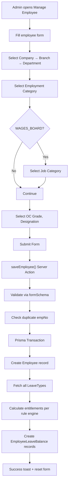

---

## 2. Roster Creation & Assignment Journey

### 2a. Create Roster

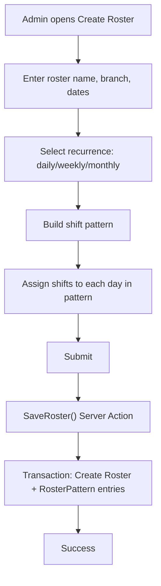

### 2b. Assign Employees to Roster

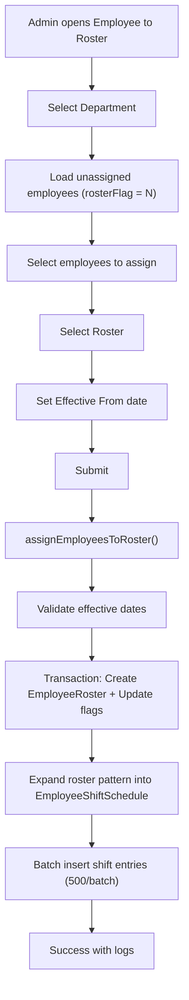

### 2c. Remove Employee from Roster

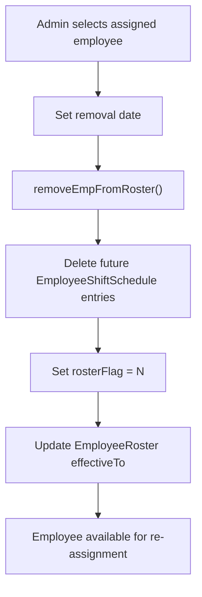

---

## 3. Attendance Processing Journey

### 3a. Import Biometric Data

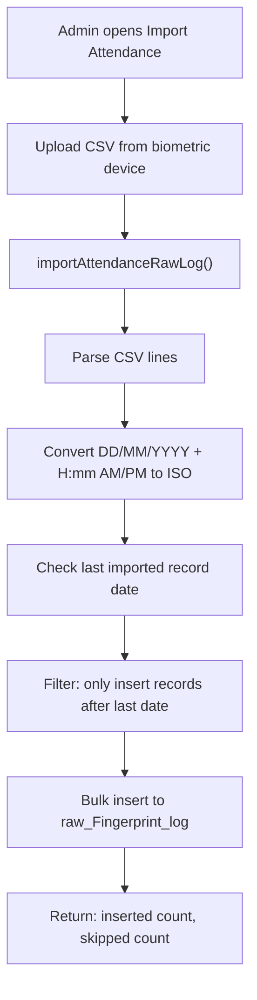

### 3b. Sync Attendance

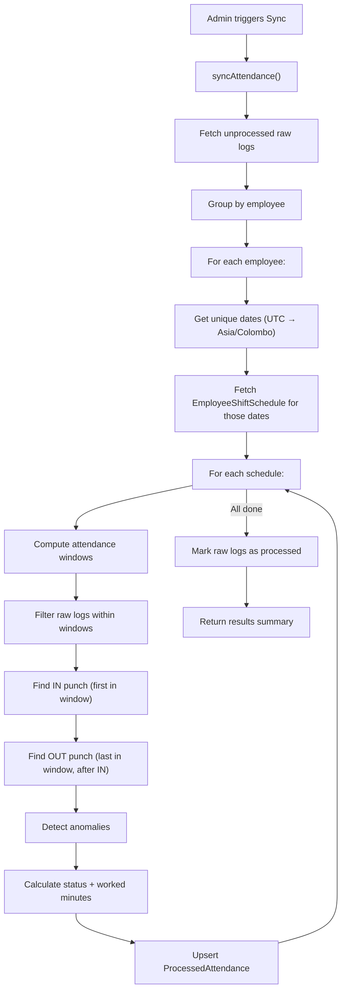

---

## 4. Authentication Flow

### 4a. Sign-In

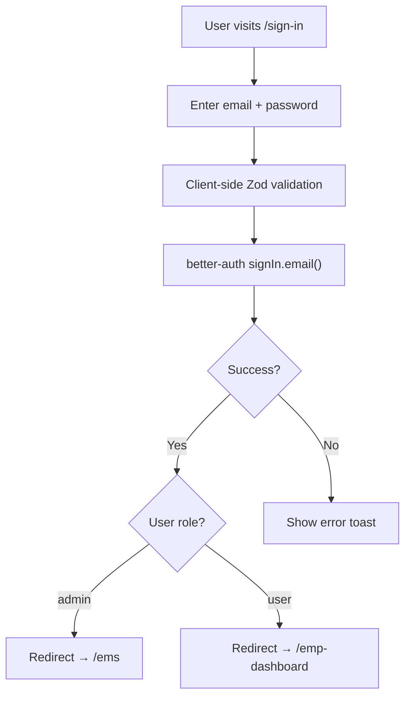

### 4b. Password Reset

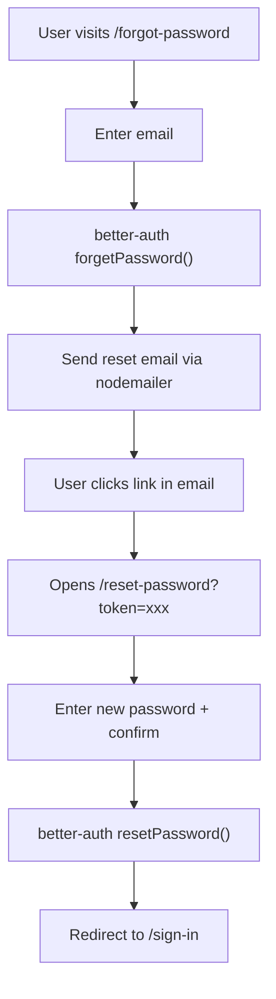

---

## 5. Report Generation Journey

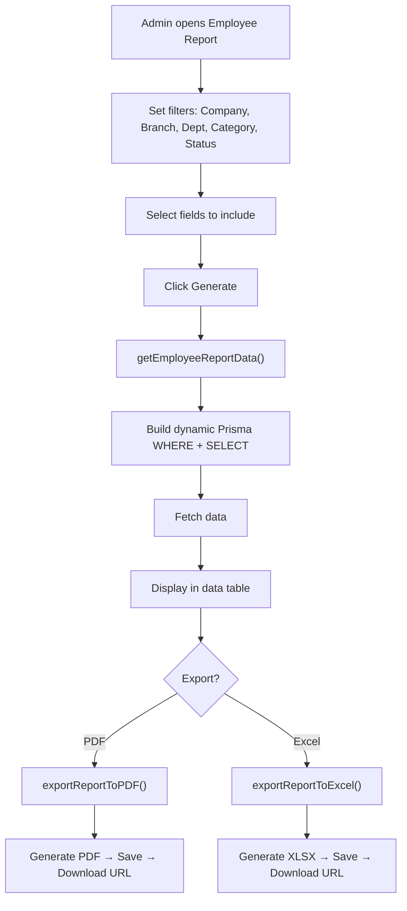

---

## 6. Organization Setup Flow

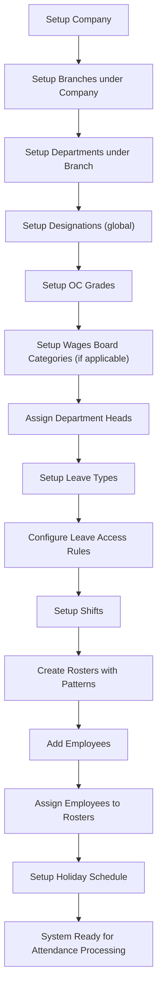

---

## 7. HOD Management Flow

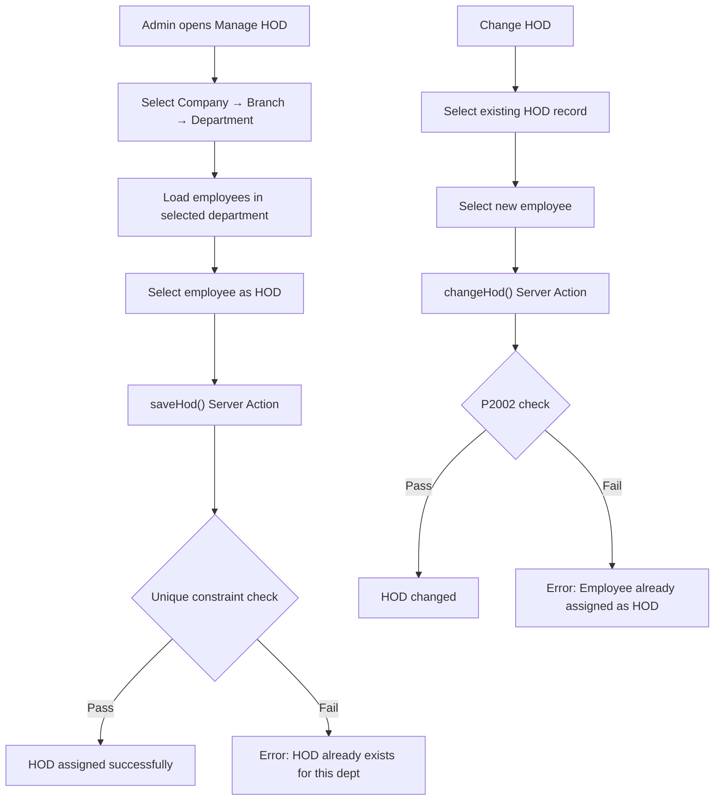

---

## 8. Data Flow Diagram

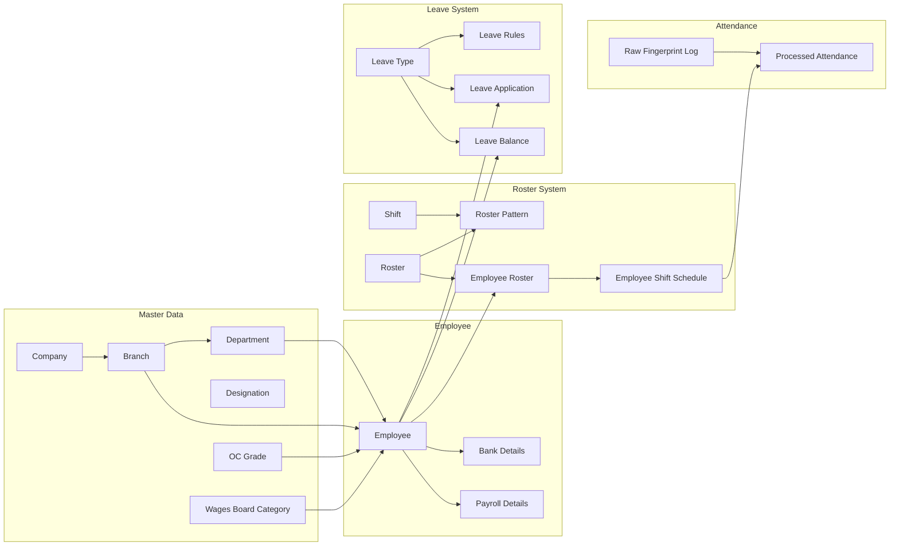
